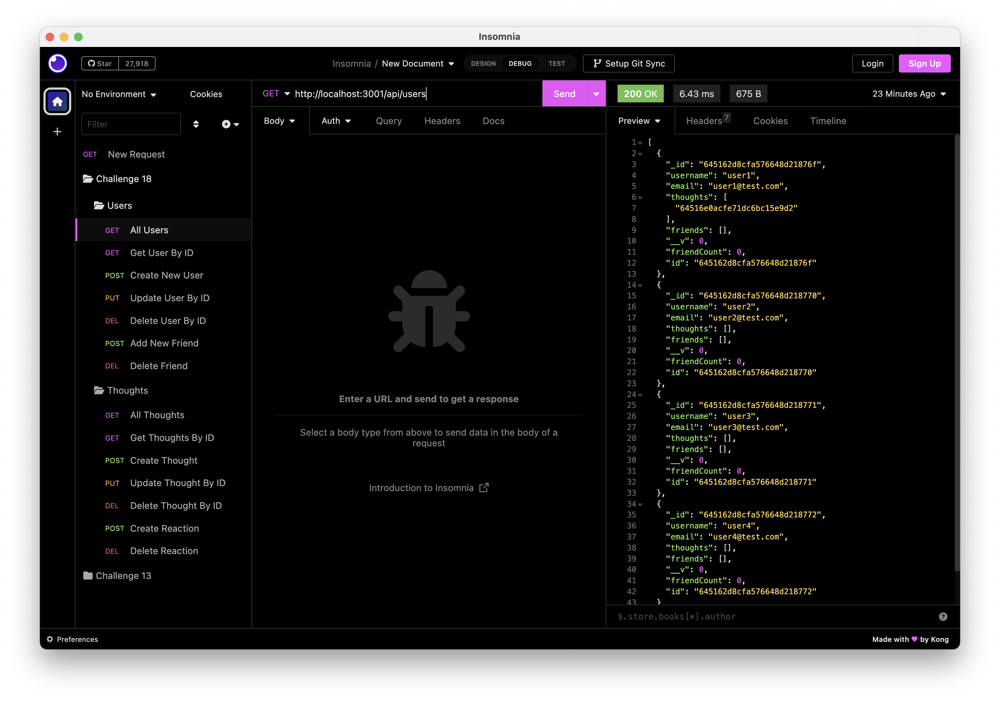
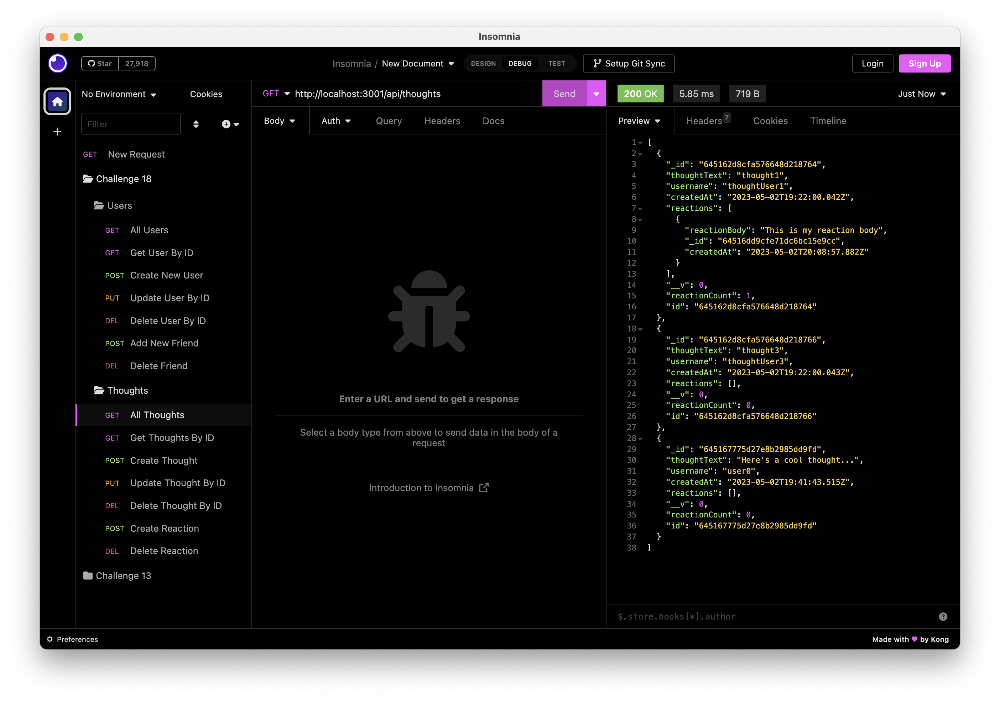

# the-social-network
A social network created using MongoDB + Mongoose. Features users, friends, thoughts and reactions.

## Description

I was motivated to create this project as a means to learn more about Sequelize and Express.JS within a real life application. I built this app in order to better understand the data flow and the principles of CRUD. From there, I utilized Sequelize to perform queries of my data, eliminating the need for MySQL queries myself. Diving into Sequelize really saved me a lot of time and made working with the database very seamless. 

I was motivated to create this project to gain more insight and knowledge on using MongoDB to store data and Mongoose to interact with that data. I built this app in order to simulate a social network of user data and to see how that data can interact with each other. I really enjoyed this working on this application, creating the structure of the directory, building the models and into the routes + controllers. It was great to see it all come together and seeing the data pull into different arrays.

## Installation

The steps to install my project are as follows:

- Clone or fork my code from GitHub
- Install the required dependencies (Express Mongoose, Nodemon)
- Run "npm run seed" to insert the testing data into MongoDB
- Run the file from the command line using "npm run start"
- Use Postman or Insomnia to interact with the server, as this app is not live
- *Recommend* using Nodemon to restart your server automatically

## Usage

Here is a link to a video of the file running:

[Google Drive Video](https://drive.google.com/file/d/1O56G29md3QxZc18lMI9G1-bNivQNnLgU/view?usp=sharing)

This is an example of getting all Users in Insomnia:

This is an example of getting all Thoughts in Insomnia:

## License

MIT License

Copyright (c) 2023 Erich Z.

Permission is hereby granted, free of charge, to any person obtaining a copy of this software and associated documentation files (the "Software"), to deal in the Software without restriction, including without limitation the rights to use, copy, modify, merge, publish, distribute, sublicense, and/or sell copies of the Software, and to permit persons to whom the Software is furnished to do so, subject to the following conditions:

The above copyright notice and this permission notice shall be included in all copies or substantial portions of the Software.

THE SOFTWARE IS PROVIDED "AS IS", WITHOUT WARRANTY OF ANY KIND, EXPRESS OR IMPLIED, INCLUDING BUT NOT LIMITED TO THE WARRANTIES OF MERCHANTABILITY, FITNESS FOR A PARTICULAR PURPOSE AND NONINFRINGEMENT. IN NO EVENT SHALL THE AUTHORS OR COPYRIGHT HOLDERS BE LIABLE FOR ANY CLAIM, DAMAGES OR OTHER LIABILITY, WHETHER IN AN ACTION OF CONTRACT, TORT OR OTHERWISE, ARISING FROM, OUT OF OR IN CONNECTION WITH THE SOFTWARE OR THE USE OR OTHER DEALINGS IN THE SOFTWARE.

